# Project Overview

The repository contains an Airflow DAG `uber_rides_iceberg` that orchestrates a layered batch analytics pipeline on ***Trino*** + Iceberg: raw ingestion -> normalization -> curated marts for dashboarding.

The data source is uber rides [dataset](https://www.kaggle.com/datasets/yashdevladdha/uber-ride-analytics-dashboard?resource=download)

The dataset captures 148,770 total bookings across multiple vehicle types and provides a complete view of ride-sharing operations including successful rides, cancellations, customer behaviors, and financial metrics.


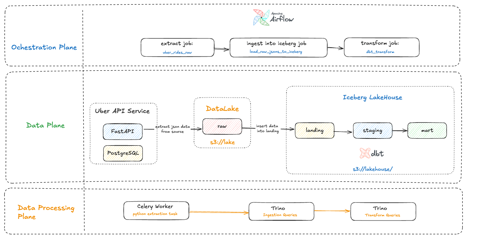


## Useful links
- Airflow UI: http://localhost:8080 (user: airflow, password: airflow)
- Nessie UI: http://localhost:19120 
- Trino UI: http://localhost:8080/ui (just type any username you want)
- Source Uber API service: http://localhost:8000/docs
- MinIO UI: http://localhost:9001 (user: admin, password: password)
- Streamlit app [a basic dashboard]: http://localhost:8501 (open after first successfull run of the pipeline)


## Source Data API
The data is exposed through a lightweight FastAPI service as JSON: the response is a list of ride booking objects, 
and results can be filtered by date.

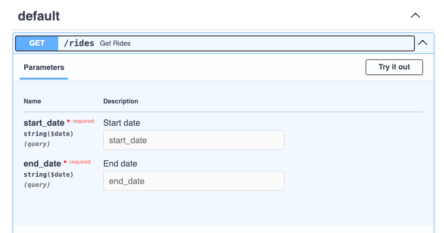
Example API response (truncated for brevity):
```json
[
  {
    "booking_date": "2025-09-30",
    "booking_time": "14:53:16.653Z",
    "booking_id": "string",
    "booking_status": "string",
    "customer_id": "string",
    "vehicle_type": "string",
    "pickup_location": "string",
    "drop_location": "string",
    "avg_vtat": 0,
    "avg_ctat": 0,
    "cancelled_rides_by_customer": 0,
    "reason_for_cancelling_by_customer": "string",
    "cancelled_rides_by_driver": 0,
    "driver_cancellation_reason": "string",
    "incomplete_rides": 0,
    "incomplete_rides_reason": "string",
    "booking_value": 0,
    "ride_distance": 0,
    "driver_ratings": 0,
    "customer_rating": 0,
    "payment_method": "string"
  }
]
```

## Data Flow

1. Landing: Raw Uber rides JSON loaded into Iceberg namespace `landing`.
2. Staging: Cleaning, normalization, incremental transformations in `staging`.
3. Marts: Curated fact / dimension style tables in `marts` for BI and lightweight app use.

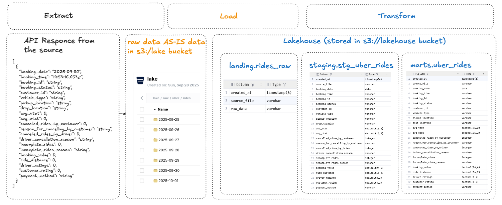

## Storage & Query Engine

- **Trino** catalogs persisted by mounting host directory `trino/trino_config/catalog` (or a persistent `volumes/trino/catalog`) to `/etc/trino/catalog` so definitions survive container restarts.
- Iceberg tables managed via **Trino** SQL (DDL / DML tasks inside the DAG).

## Orchestration

- Airflow DAG `uber_rides_iceberg` schedules sequential tasks: ingest, transform, publish.
- Failures surfaced in Airflow UI task logs.

## dbt layers
- `landing`: Raw data load (append-only).
- `staging`: Data cleaning, type casting, flattening nested JSON, incremental updates.
- `marts`: Curated tables for analysis (e.g. `uber_rides`, `uber_rides_daily_metrics`)

all the layer are build via `dbt`+`Trino` in Iceberg.

Beware, nessie catalog does not support Views in Iceberg. Thus, the demo uses either tables or incremental tables where appropriate.

## Dashboarding

- Basic Streamlit app provides a minimal exploratory dashboard over curated marts.

## Containers (Highlights)

- **Trino** coordinator and workers share mounted catalog directory for persistence.
- Streamlit app reading from **Trino** (via Python client or SQLAlchemy).

## Key Paths

- **Trino** catalogs: `trino/trino_config/catalog`
- Coordinator config: `trino/trino_config/coordinator/config.properties`
- Worker config: `trino/trino_config/worker/config.properties`
- Compose file: `docker-compose.yml`
- DAG file: (Airflow DAGs directory containing `uber_rides_iceberg`)
- Streamlit app: (project `streamlit` or equivalent folder)

## Summary

End-to-end reproducible analytics stack: ingestion -> modeling -> marts -> lightweight Streamlit Dashboard, all backed by **Trino** + Iceberg with persistent catalog configuration.


# Setup
<details>
  <summary>Click to expand the Setup </summary>

## Start up the stack
Start the containers:
```shell
make up
````

Create the schemas in Trino:
```shell
make init-trino
```


## Setup Airflow Connections
### 1. Trino connection:
Airflow UI: Admin -> Connections -> Edit trino_conn
Conn Type: Trino

Host: http://trino-coordinator

Port: 8080

Description: A connection to **Trino** query engine

Login: airflow (any non-empty user)

Schema: landing (**Trino** schema / Iceberg namespace)

Extra (JSON, (adjust catalog name)):
```json 
{"catalog": "iceberg"} 
```
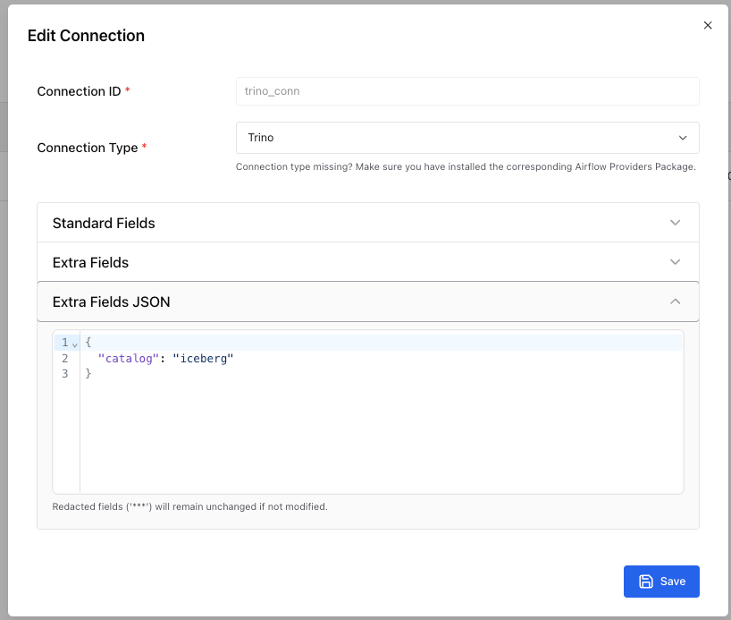
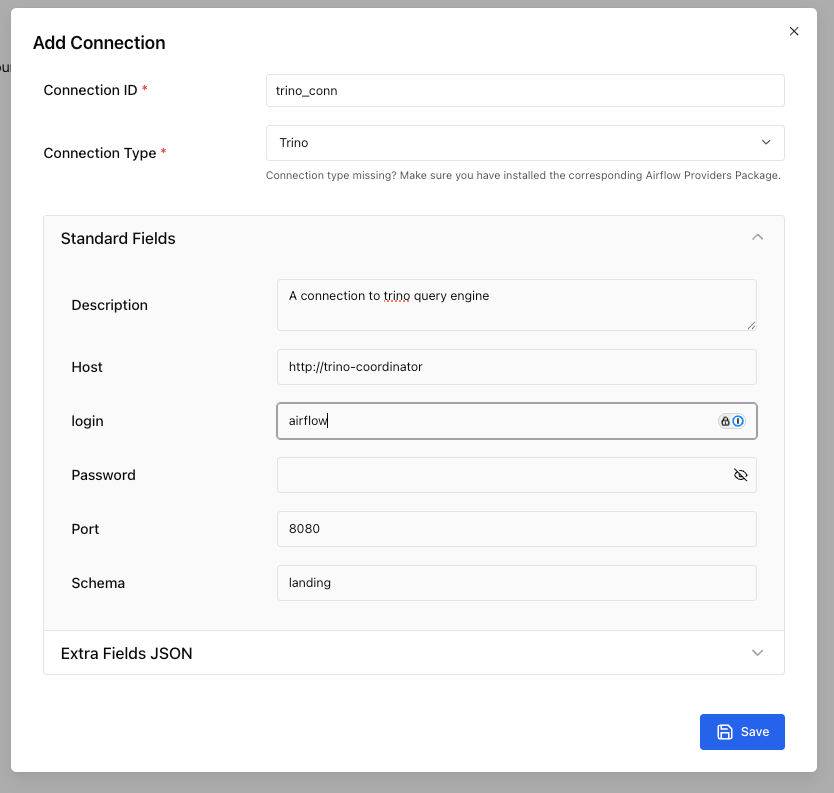
### 2. S3 connection:
 Airflow UI: Admin -> Connections -> Edit s3_conn

 Conn Type: Amazon Web Services

 Description: A connection to S3 compatible storage
 Login: admin

 Password: password

 Extra (JSON):
 

```shell
{
  "endpoint_url": "http://minio:9000",
  "region_name": "us-east-1"
}
```
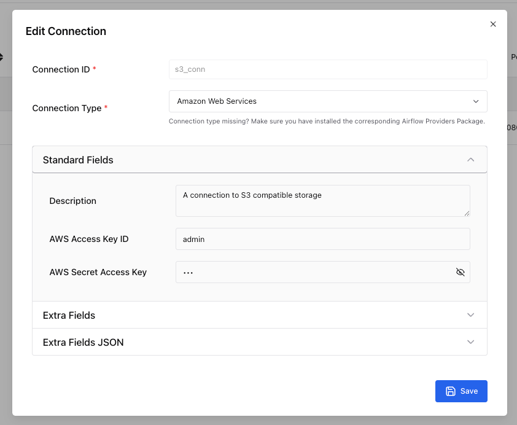
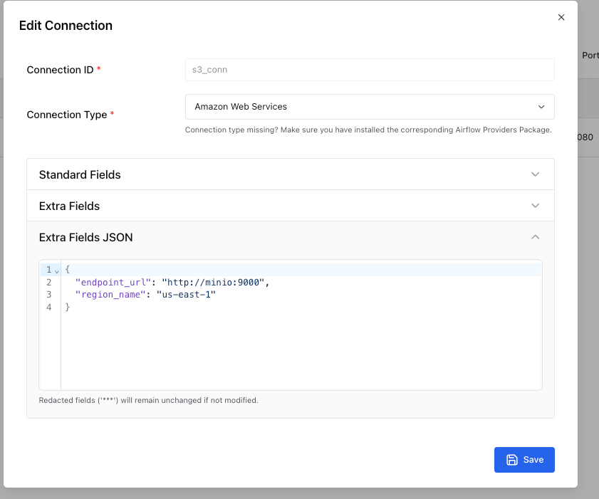

### Verify if the source service is up and running
To check the output of api server:
1. either open a swagger in the browser http://localhost:8000/docs
2. or use curl
```shell
curl -X GET "http://localhost:8000/rides?start_date=2025-08-01&end_date=2025-08-02" -H "Accept: application/json"
```

</details>

# Demo
## Start the DAG
Go to Airflow UI (http://localhost:8080) and find the `uber_rides_iceberg` DAG.
The DAG contans the following steps:
1. **uber_rides_raw** - fetch the data from the API and store the API response in json format AS-IS in s3 bucket `s3://lake` (data lake)
2. **create_iceberg_rides_raw_json** - create an Iceberg table in the `landing` schema with 3 columns: 
   - created_at (timestamp)
   - source_file (string) 
   - raw_data (json)
3. **load_raw_jsons_to_iceberg** - load the raw json files from s3 to the Iceberg table in the `landing` schema
4. **dbt_transform_rides** - trigger a dbt job to transform the data from the `landing` schema to the `staging` and `marts` schemas.

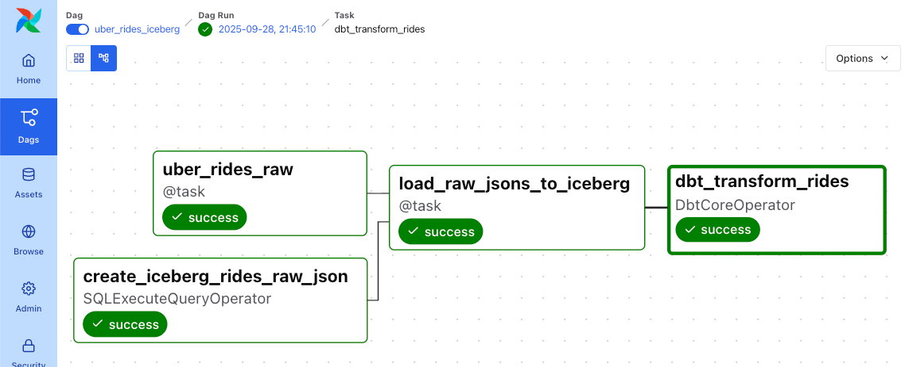

Click on start, then check the logs, verify if all steps were scuccessful by checking the logs.
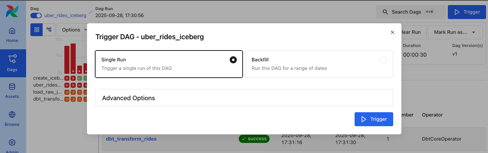

Verify if all steps were successful by checking the logs and airflow UI.
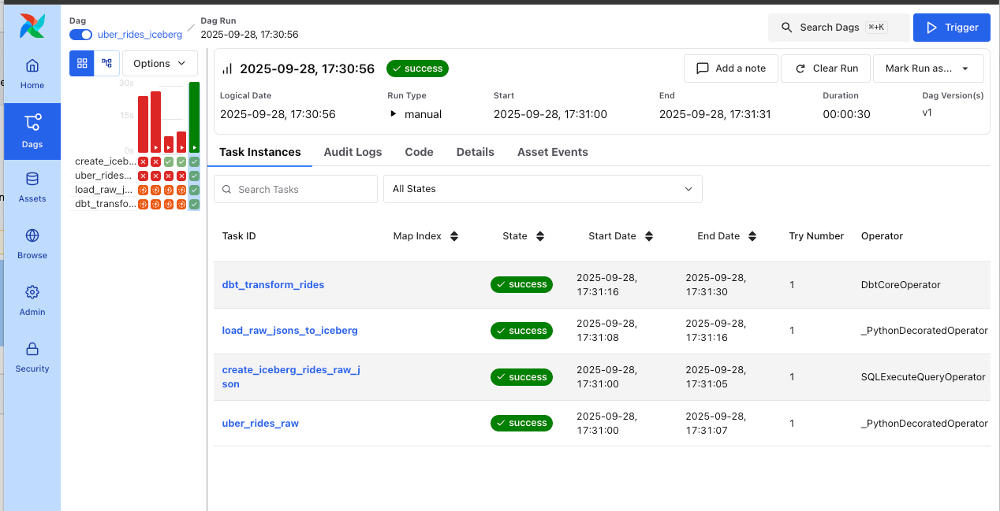

## Check the data in Trino
### Create a connection to Trino 
Create a connection to **Trino** using your favorite SQL client (e.g. DBeaver, TablePlus, etc.) or use the **Trino** CLI.

### Run the data discover queries
```sql
-- raw/landing layer
select * from iceberg.landing.rides_raw limit 10;

-- staging layer
select * from iceberg.staging.stg_uber_rides limit 10;

-- mart layer
select * from iceberg.marts.uber_rides limit 10;
```
#### Raw/landing layer
A table with raw data, contains 3 columns:
- created_at: timestamp
- source_file: a path to the source file in s3
- raw_data: a raw from source file in a json format

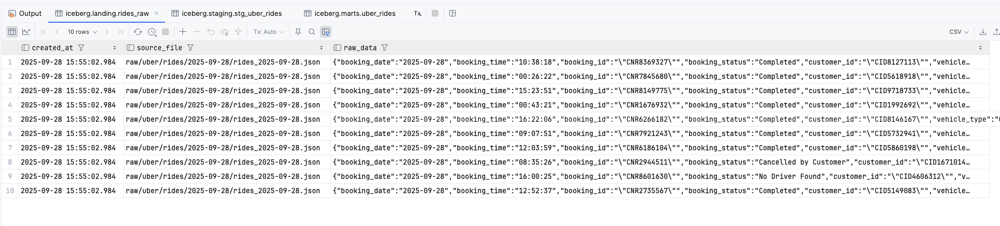

#### Staging layer
A cleaned and flattened table, contains:
- created_at: timestamp (from the raw data)
- source_file: a path to the source file in s3 (from the raw data)
- flattened columns from the raw json data

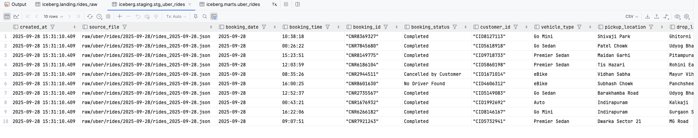

#### Mart layer
Contains a final format ready for consumption by customers (BI, Analytics, etc).


Next:
- faile the job if dbt fails or has errors
- think about adding separate pipeline for analytics
- add metabase integaration for dashboards
- create slides